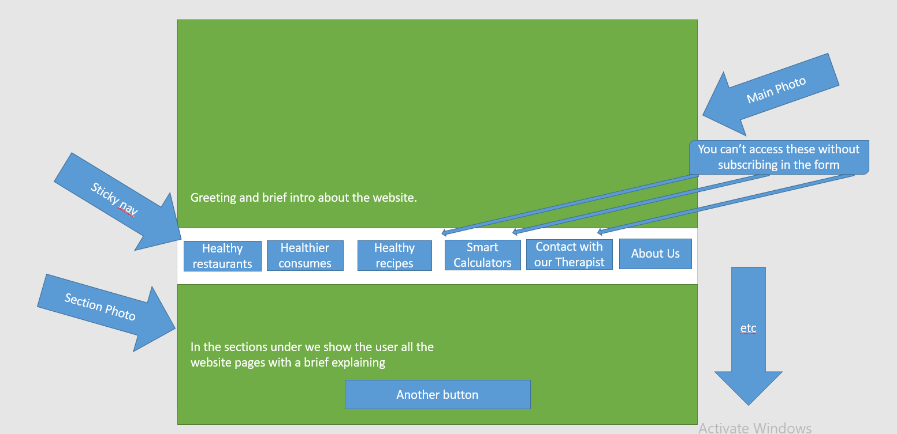
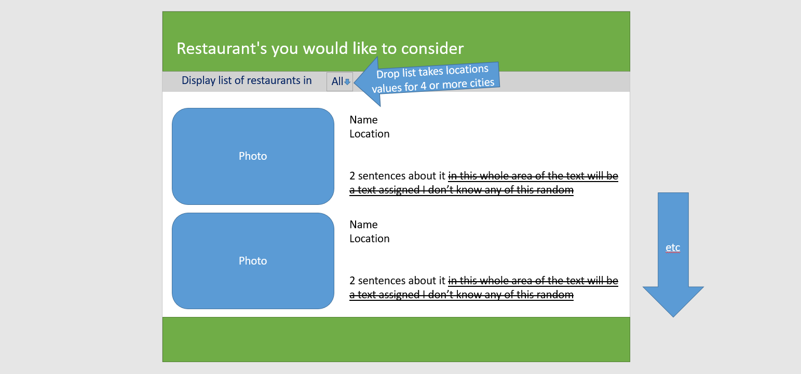
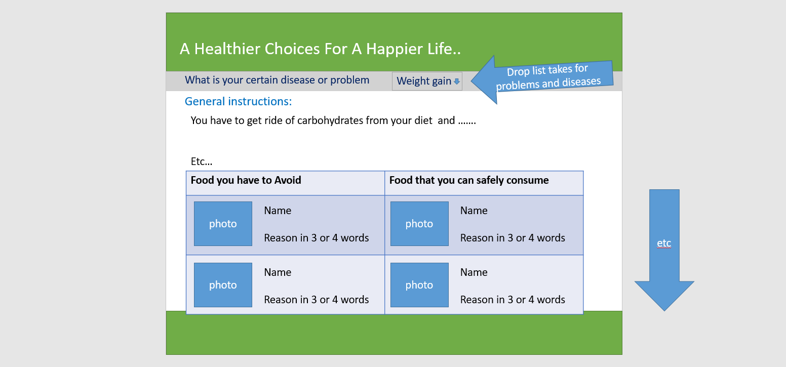
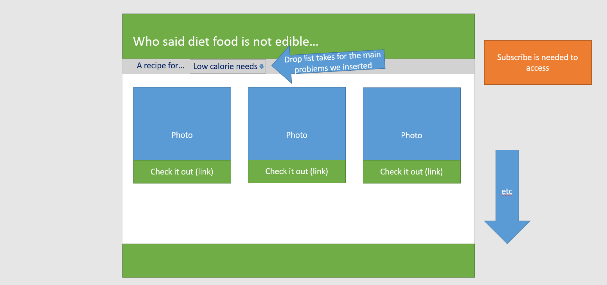
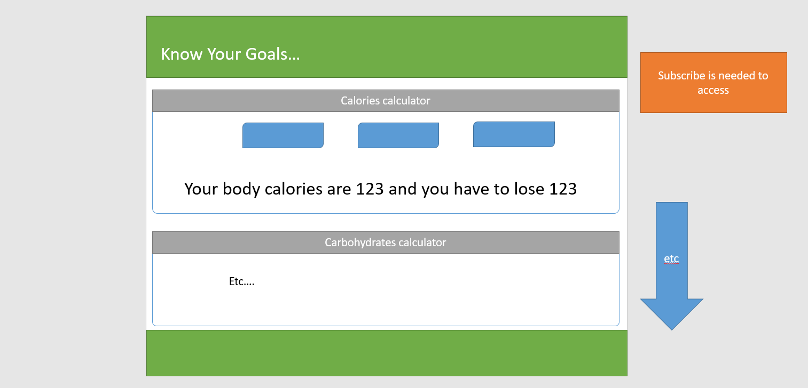
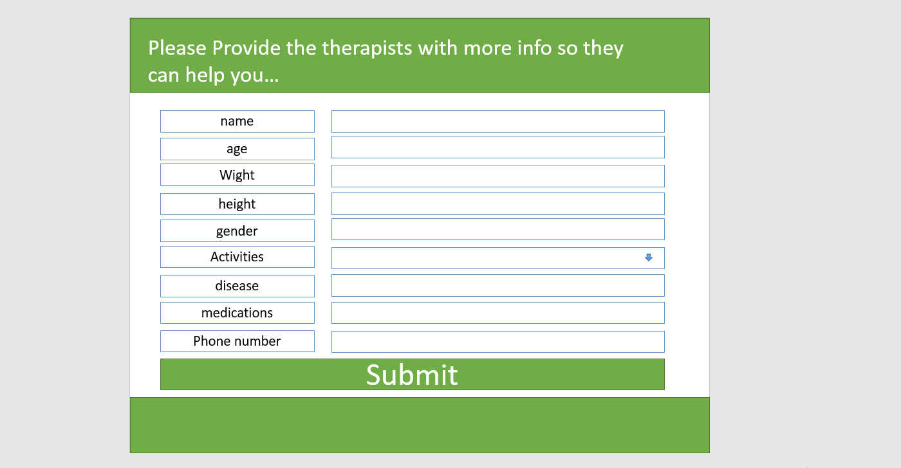
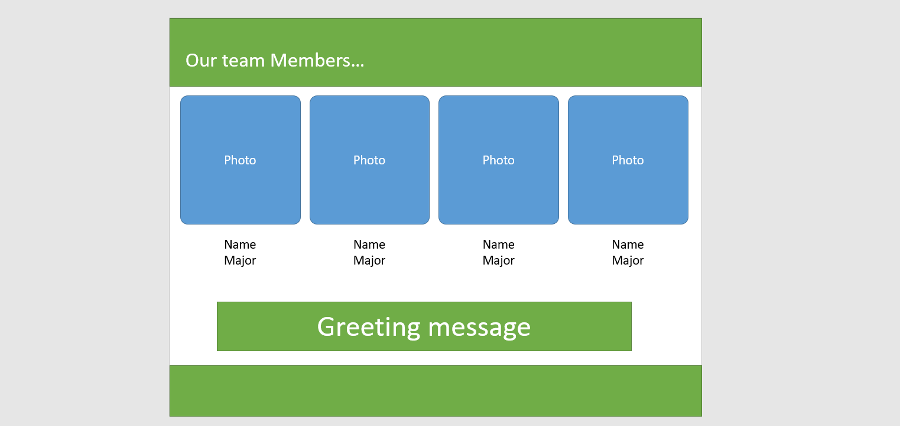
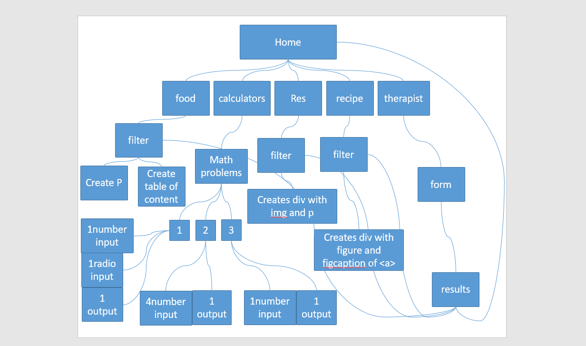

# Health-Care

## Wireframe Images

## 5 User's stoies

1. I started a diet before a month and I am facing problems hangging out with my friends and they always order fast-food from random restaurants don't match with my diet, so I want to find good restaurants nearby that provide healthy food.
2. I was diagnosed with hypertension a year ago and since then I am facing a problem to know what kind of food I am allowed to eat and what should I avoid.
3. As a diabetic patient I always make my dessert at home, so I need easy recipes that suits my taste and won't affect my suger levels.
4. 2 months ago I was diagnosed with diabetes type 2 and I am still confused about the units of insulin I have to take depends on meals.
5. I am looking for an online Dietician that can help me to follow a better diet for my condition.

## Domain Modeling

